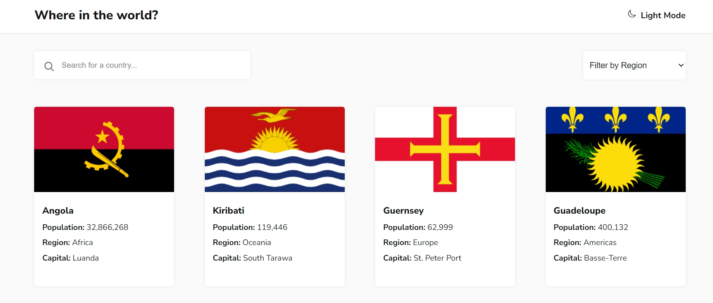
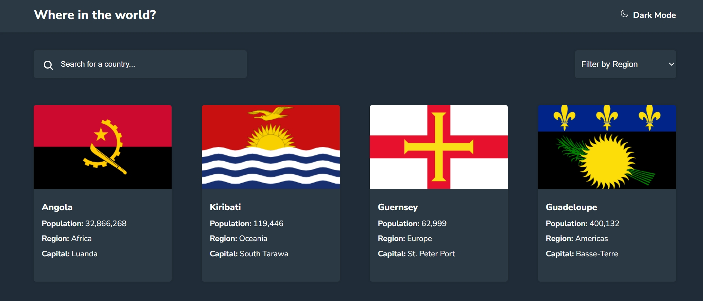
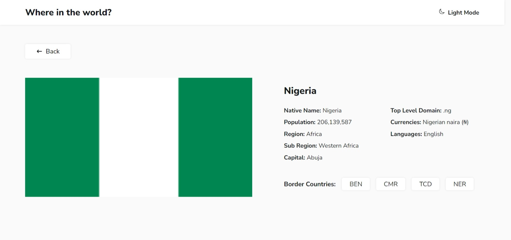
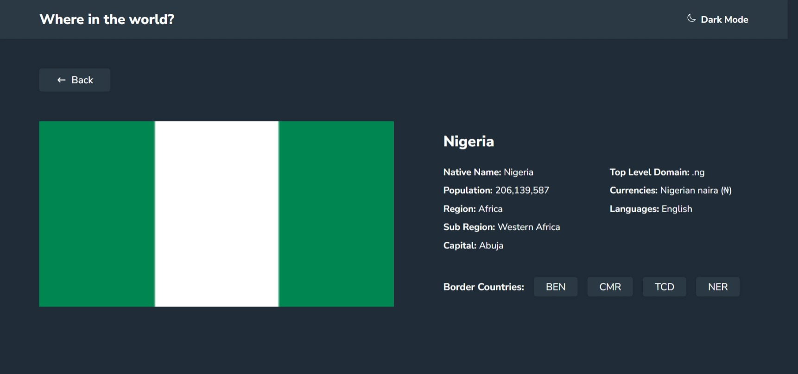

# Frontend Mentor - REST Countries API with color theme switcher solution

This is a solution to the [REST Countries API with color theme switcher challenge on Frontend Mentor](https://www.frontendmentor.io/challenges/rest-countries-api-with-color-theme-switcher-5cacc469fec04111f7b848ca). Frontend Mentor challenges help you improve your coding skills by building realistic projects. 

## Table of contents

- [Overview](#overview)
  - [The challenge](#the-challenge)
  - [Screenshot](#screenshot)
  - [Links](#links)
- [My process](#my-process)
  - [Built with](#built-with)
  - [Continued development](#Continued-development)
- [Author](#author)

## Overview

### World Countries Explorer

Welcome to World Countries Explorer! Discover detailed information about every country in the world. Search for any country or filter by region to find exactly what you need quickly and easily. Perfect for geography enthusiasts, students, and travelers. Start exploring today!

### The challenge

Users should be able to:

- See all countries from the API on the homepage
- Search for a country using an `input` field
- Filter countries by region
- Click on a country to see more detailed information on a separate page
- Click through to the border countries on the detail page
- Toggle the color scheme between light and dark mode *(optional)*

### Screenshot

### Links

- Solution URL: [Add solution URL here](https://github.com/Tomtiko04/World-Countries-Explorer)
- Live Site URL: [Add live site URL here](https://world-countries-explorer.vercel.app/home)

### Built with

- Semantic HTML5 markup
- CSS custom properties
- Flexbox
- CSS Grid
- Mobile-first workflow
- [Vite.js](https://vitejs.dev/) - React framework

### What I learned

Developing Dark Mode feature

### Continued development

Adding a loading spinner when contents are fetching.

## Author

- Email - ogunneyeoyinkansola@gmail.com
- Frontend Mentor - [@Tomtiko04](https://www.frontendmentor.io/profile/Tomtiko04)